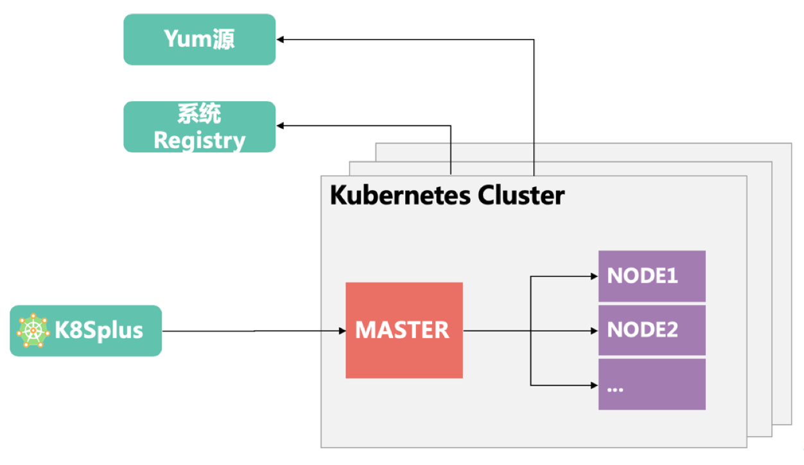
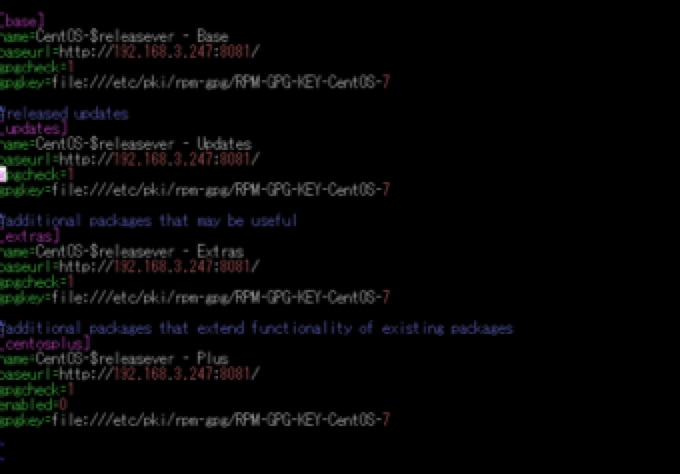
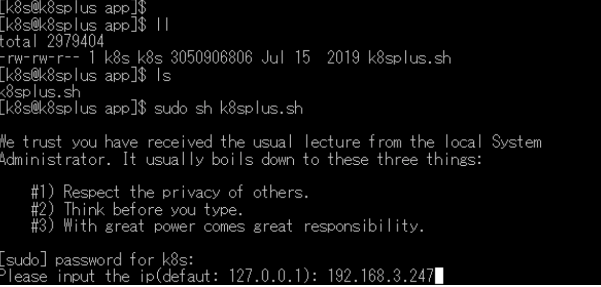
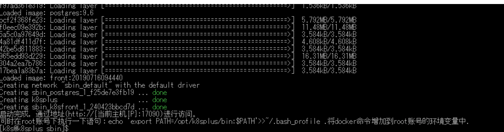

# **watch is k8splus**

K8splus是一套基于kubernetes容器管理平台。让用户更加轻松实现多集群的管理，轻松对服务进行构建、发布、运行、观测，轻松提供微服务架构的发布和运维。让DevOps团队更加轻松快速测试、部署和管理其应用程序。同时实现多租户的资源隔离和管理，更加适用于企业开发的应用场景。



如上图图所示，k8splus负责连接主机进行安装集群、管理集群。在k8splus启动时，会附带yum源和系统registry启动。

* Yum源：里面存放kubernetes安装过程中所需的rpm包，实现在完全没有互联网的情况下实现kubernetes安装。
*  系统Registry：存放kubernetes安装过程中所需的镜像文件，解决kubernetes安装过程中到外网下载镜像慢的问题。
* K8splus安装完成集群后，通过采用TLS与kubernetes的master进行通讯，对集群进行管理。同时k8splus支持多集群，多租户的管理。对集群的安装、集群的管理、应用的发布以及对kubernetes的使用更加方便。

# k8splus安装

## 安装前环境准备

  主机HostName   主机IP          操作系统    担当角色

------

  Master         192.168.3.247   Centos7.2   k8splus服务， master节点
  Node1          192.168.3.248   Centos7.2   node节点
  Node2          192.168.3.249   Centos7.2   node节点
  Node3          192.168.3.250   Centos7.2   node节点

表格 2-1 主机列表

以下问题需要注意(所有主机)

1. 确保主机能够安装nfs服务。
2. 主机系统centos7.2或 7.2以上的操作系统。
3. 修改各主机的hostname，每台主机名不同,hostname允许半角应数字、中划线和点。
4. 主机完全不能访问外网情况需要修改yum源。
5. 确认各主机没有安装docker服务(由于自行安装的docker服务版本和存储位置不同会导致安装失败)。
6. 关闭主机/etc/sysconfig目录下的selinux和防火墙，centos7.2以上的系统修改后最好重启机器避免修改不生效。
7. 需要使用共享存储的请自行安装nfs服务端，各node节点安装nfs客户端。

关闭防火墙和selinux

```shell
#关闭防火墙
systemctl stop firewalld
systemctl disabled firewalld
#关闭selinux
vim /etc/selinux/config
SELINUX=disabled
```

安装主机在不能访问网络的情况下，首先修改yum源如图1，可联网则跳过该步骤



<center>图1 修改yum源文件内容<center>

## K8splus的安装

### 创建sudo账号

为保证数据安全，使用root账号创建安装使用的用户和用户组并赋予sudo权限，安装完后可以删除该用户，以确保数据的安全保密。

```shell
  #添加用户和组
  groupadd k8s
  useradd -g k8s -d /opt/app k8s
  #修改密码
  passwd k8s
  #添加sudo权限
  cat /etc/sudoers
  k8s ALL=(ALL) ALL
```

### 将k8splus.sh复制到所要安装的目录下

安装目录最好选择磁盘空间较大的路径，这里安装目录使用/opt/app

```shell
  cd /opt/app
```

### 安装k8splus

使用sudo账号执行安装文件，root账号直接执行sh命令

```shell
sudo sh k8splus.sh
```

执行后如图2 提示输入k8s的密码和安装k8dplus主机的IP 192.168.3.247（考虑到多网卡的情况，在这里输入可供外网访问的IP）。按下回车键后，会自动解压安装



图 2输入ip

等待出现图3的内容，至此k8splus的安装完成了



图 3安装成功